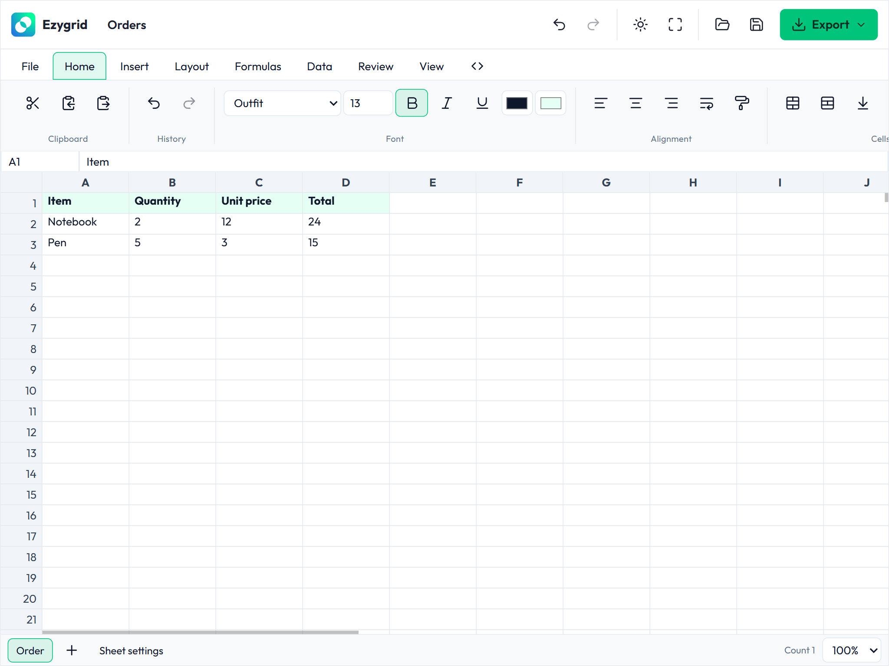

# ezygrid

[](https://opensource.org/licenses/MIT)
[](https://github.com/bookklik-technologies/ezygrid)

Framework-agnostic JavaScript/TypeScript spreadsheet and data-grid library by
[Bookklik Technologies](https://github.com/bookklik-technologies).



## Features

- Spreadsheet and data-grid engine with a workbook/worksheet facade
- Excel-compatible formula engine — lexer/parser/AST, dependency graph, function library
- Sparse document model with stable IDs, A1 utilities and a typed operation format
- Rendering, selection, editing and history
- Declarative (`data-ezg-editor`), programmatic and script-tag initialization
- Framework integrations for Angular, React, Vue and a web component

## Documentation

Full guides and API reference: <https://bookklik-technologies.github.io/ezygrid/>

## Quick start

### Declarative (browser bundle)

```html
<div data-ezg-editor style="height: 460px"></div>
<script src="/ezygrid/ezygrid.js"></script>
```

Copy the complete `packages/core/dist/browser/` directory to your static
assets (build it from this repository with `pnpm build`). The loader fetches
its dependency files relative to itself and enables declarative startup
automatically — no consumer bundling step is required.

### ESM / bundlers

```html
<div id="editor" style="height: 460px"></div>
```

```js
import { Ezygrid } from '@ezygrid/core';

const editor = new Ezygrid({ target: '#editor' });
```

Or use the automatic startup entry point with declarative markup:

```js
import '@ezygrid/core/auto';
```

See [Getting started](docs/getting-started.md) for configuration, lifecycle,
and dynamic hosts.

## Examples

Runnable demos in the [examples folder](examples/README.md) — served via any
static server (e.g. WAMP: `http://localhost/ezygrid/examples/`).

## Development

```sh
pnpm install
pnpm test        # vitest across all packages
pnpm build       # tsc project references build
pnpm typecheck
```

## Status

Early development — APIs are still stabilizing; treat it as non-production.

## License

MIT
